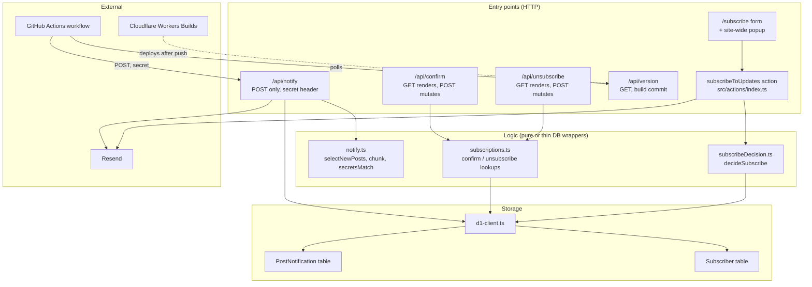
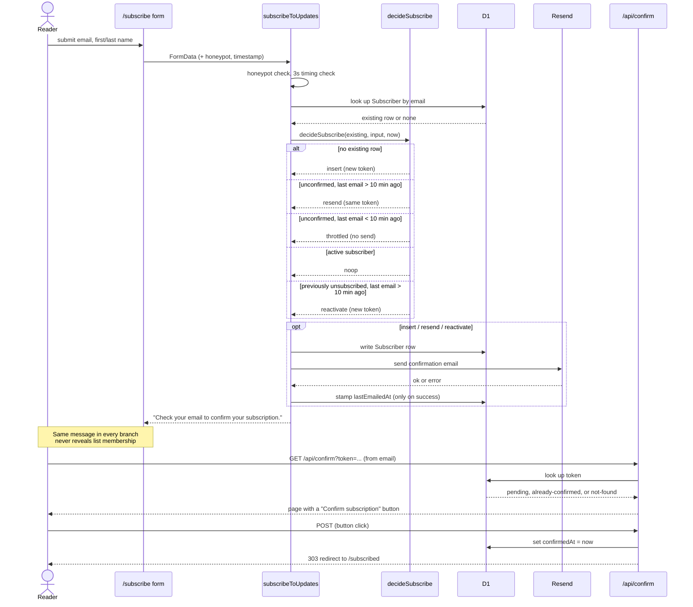
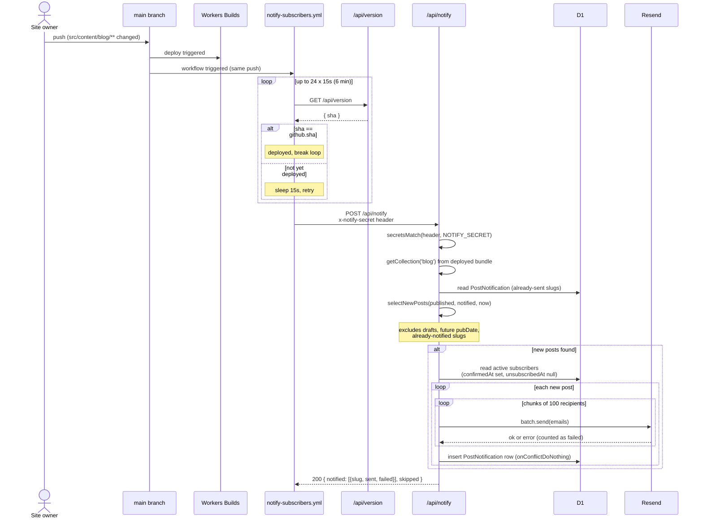
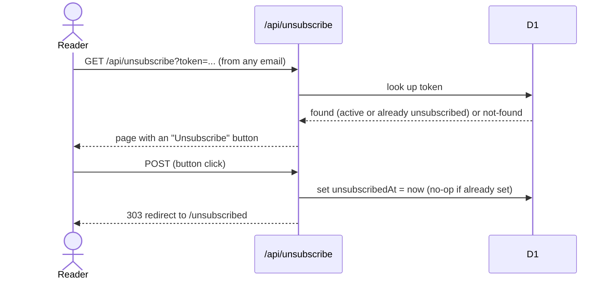

# Subscriber notification flow

Reference for feature 14 (`blueprint/history/features/14-notify-subscribers-of-new-blog-posts.md`)
and fix F-11 (`blueprint/history/fixes/throttle-confirmation-resends.md`). Reflects
`main` as of this writing: confirmation is a GET page with a POST button, not a
one-click confirm-on-load link. Update the "Subscribe and confirm" diagram if
that changes.

## 1. Layer map

Entry points handle HTTP. Logic decides what should happen. Storage holds
state. Nothing here talks to Resend or D1 except through the layer below it.

## 2. Subscribe and confirm

Double opt-in. The confirmation email link is a GET (safe for mail-scanner
prefetch); the reader clicks a button on the page to actually confirm.

## 3. Publish and notify

Triggered by pushing a blog post, not on a schedule. The workflow waits for
the live deploy to actually contain the new post before calling `/api/notify`.

## 4. Unsubscribe

Same GET-renders / POST-mutates shape as confirm, and idempotent: clicking
twice is not an error.

## 5. Route reference

| Route | Method | Mutates D1 | Auth | Result |
|---|---|---|---|---|
| `/subscribe` | Action (POST via form) | insert/update `Subscriber` | honeypot + timing | success message, confirmation email sent |
| `/api/confirm?token=` | GET | no | token in URL | HTML page, `pending` / `already-confirmed` / `not-found` |
| `/api/confirm` | POST | `confirmedAt` | token in form body | 303 to `/subscribed`, or 404 page |
| `/api/unsubscribe?token=` | GET | no | token in URL | HTML page, `found` / `already` / `not-found` |
| `/api/unsubscribe` | POST | `unsubscribedAt` | token in form body | 303 to `/unsubscribed` (idempotent) |
| `/api/notify` | POST | insert `PostNotification` | `x-notify-secret` header (timing-safe) | JSON `{ notified, skipped }` |
| `/api/version` | GET | no | none | JSON `{ sha }`, `Cache-Control: no-store` |

Confirm and unsubscribe pages are `noindex, nofollow` and excluded from the
sitemap. `/api/notify` is never crawled (POST only).
